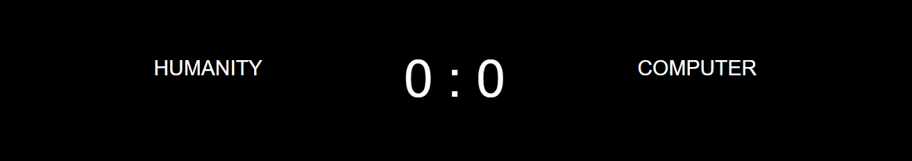

# RPS of destiny

## Features 

In this Rock, Paper, Scissors game, the user is hinted at a little fun plot that adds to the excitement of the game. The user can pretend that he is fighting in a battle of probability, representing humanity while his opponent, the randomly generated code, is representing artificial intelligence. Thus, when the user gets his three wins against the machine, it is as if he had saved humanity from the doom of machines taking over. A simple storyline to add to the thrill of our little Rock, Paper, Scissors game.

### Existing Features

- __The Game Title and Heading__

  - Featured at the top of the page, the title is fixed and does not change upon resetting the one page game.

- __The Instructions Text__

  - This Text appears upon opening the game and after resetting it. 

- __The Score Area__

  - This section keep track of the scores for both players. 

- __The Buttons__

  - Three buttons are used to represent the RPS choices respectively. 

- __The One Round Win Text__

  - This Text appears upon winning one round. 

- __The One Round Loss Text__

  - This Text appears upon winning one round. 

- __The Full Game Win Text__

  - This Text appears upon winning three rounds. 

- __The Full Game Loss Text__

  - This Text appears upon losing three rounds.

- __The Reset button__

  - This button can be used to reset the game and play again. 

### Features Left to Implement

- Animations for winning, losing, and clicking the three buttons. 

## Testing 

I had to change my functions multiple times before getting the desired result. First, there was an issue with the user winning. It was always either computer winning or draw, but I fixed that eventually. I then had an issue with the three wins and losses, I had to research and read many articles related to that function from reddit, stackoverflow, and greenfoot before I was able to understand it, although it seemed simple at first glance. 

After I fixed the functions and got the game running as expected, I added the responsive screen rules in CSS, then tested different screen sizes using chrome developer tools, and all was responding well and adjusting accordingally. 

### Validator Testing 

- HTML
    - No errors were returned when passing through the official [W3C validator](https://validator.w3.org/nu/#textarea)
- CSS
    - No errors were found when passing through the official [(Jigsaw) validator](https://jigsaw.w3.org/css-validator/validator)
- JavaScript
    - No errors were found when passing through the official [Jshint validator](https://jshint.com/)
      - The following metrics were returned: 
      - There are 17 functions in this file.
      - Function with the largest signature takes 2 arguments, while the median is 0.
      - Largest function has 9 statements in it, while the median is 2.
      - The most complex function has a cyclomatic complexity value of 12 while the median is 1.

### Unfixed Bugs

All bugs and errors found through the validators or through testing the game have been fixed. 

## Deployment

- The site was deployed to GitHub pages. The steps to deploy are as follows: 
  - In the GitHub repository, navigate to the Settings tab 
  - From the source section drop-down menu, select the Master Branch
  - Once the master branch has been selected, the page will be automatically refreshed with a detailed ribbon display to indicate the successful deployment. 

## Credits 

 Some lines of code for layout, functions, and styling the round buttons were used from code created by Tenzin Phuljung, a software developer and owner of [Whatsdev](https://www.whatsdev.com/), a website that offers free java script courses.

### Content 

- The text for the Home page was taken from Wikipedia Article A
- Instructions on how to implement form validation on the Sign Up page was taken from [Specific YouTube Tutorial](https://www.youtube.com/)
- The icons in the footer were taken from [Font Awesome](https://fontawesome.com/)

### Media

- The three images used as icons inside the three buttons, are taken from [Shutterstock](https://www.shutterstock.com/)

